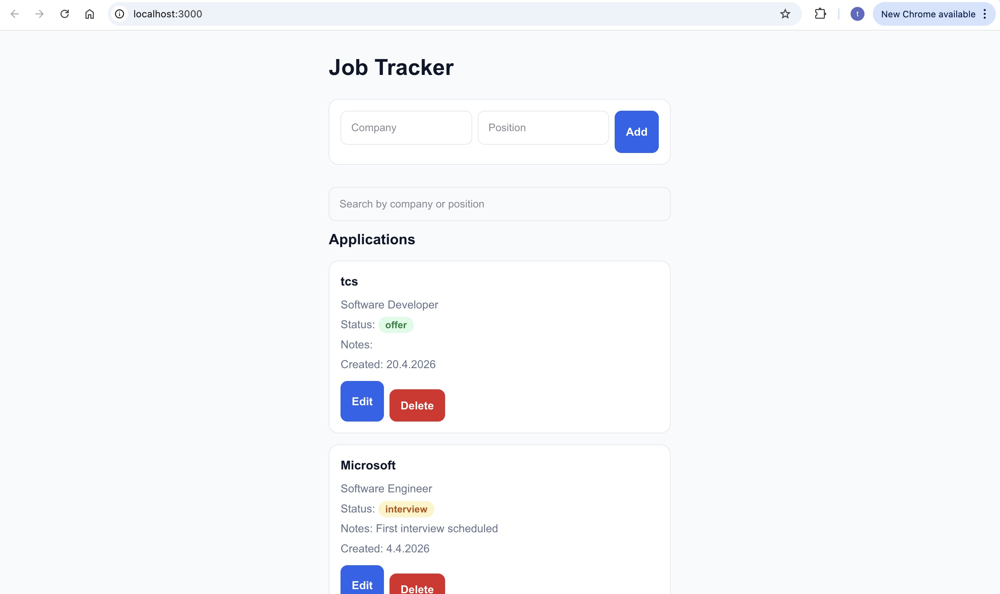

# Job Tracker – modernin web-projektin kehitysteknologiat käytännössä

## Johdanto

Tämä projekti on seminaarityö kurssille **Ohjelmistokehityksen teknologia**. Työssä toteutettiin pieni **Job Tracker** -sovellus, jonka avulla käyttäjä voi seurata omia työpaikkahakemuksiaan.

Projektin päätavoitteena ei ollut rakentaa mahdollisimman laajaa sovellusta, vaan käyttää yksinkertaista sovellusta alustana modernien ohjelmistokehityksen teknologioiden opiskeluun käytännössä. Työssä keskityttiin erityisesti siihen, miten nykyaikainen web-projekti rakennetaan, testataan, automatisoidaan ja kontitetaan.

---

## Projektin tavoite

Työn tavoitteena oli perehtyä käytännössä seuraaviin aiheisiin:

- Next.js-projektin käynnistäminen ja rakenne
- TypeScriptin hyödyntäminen React-sovelluksessa
- käyttöliittymän toteuttaminen ja tyylittely
- koodin laadun varmistaminen ESLintillä ja Prettierillä
- käyttöliittymän automaattinen testaus Robot Frameworkilla
- CI-putken rakentaminen GitHub Actionsilla
- sovelluksen kontitus Dockerilla

---

## Käytetyt teknologiat

Projektissa käytettiin seuraavia teknologioita:

- **Next.js** – sovelluksen runko
- **TypeScript** – tyypitetty kehitys
- **Tailwind CSS / CSS** – käyttöliittymän tyylit
- **ESLint** – koodin laadun tarkistus
- **Prettier** – koodin automaattinen muotoilu
- **Robot Framework** – end-to-end testaus selaimessa
- **GitHub Actions** – jatkuva integraatio (CI)
- **Docker** – sovelluksen kontitus

---

## Sovelluksen ominaisuudet

Job Tracker -sovellukseen toteutettiin seuraavat toiminnot:

- uuden työhakemuksen lisääminen
- hakemuksen poistaminen
- hakemuksen muokkaaminen
- hakemuksen statuksen päivittäminen
- hakemusten hakeminen yrityksen tai position perusteella
- tietojen tallennus selaimen `localStorage`-muistiin

Sovellus pidettiin tarkoituksella yksinkertaisena, jotta työn painopiste voitiin pitää teknologioissa eikä liian laajassa liiketoimintalogiikassa.

---

## Projektin rakenne

Projektissa käytettiin Next.js App Router -rakennetta. Koodi jaettiin pienempiin osiin, jotta rakenne pysyy selkeänä ja helposti ylläpidettävänä.


## Projektin rakenne

Projektissa käytettiin Next.js App Router -rakennetta. Koodi jaettiin pienempiin osiin, jotta rakenne pysyy selkeänä ja helposti ylläpidettävänä.

```text
src/
├── app/
│   ├── globals.css
│   ├── layout.tsx
│   └── page.tsx
├── components/
│   ├── JobForm.tsx
│   └── JobList.tsx
└── types/
    └── jobs.ts
```

## Sovelluksen käynnistäminen lokaalisti

### 1. Kloonaa projekti

```bash
git clone <repo-url>
cd job-tracker-ci-cd
```
### 2. Asenna riippuvuudet
```bash
npm install
````
### 3. Käynnistä kehityspalvelin
```bash
npm run dev
````
### 4. Avaa selaimessa
```bash
http://localhost:3000
````
## Muut hyödylliset komennot
### Production build

```bash
npm run build
````
### Käynnistä production-versio

```bash
npm run start
```
### Tarkista linttaus
```bash
npm run lint
````
### Muotoile koodi
```bash
npm run format
````
### Tarkista muotoilu ilman muutoksia
```bash
npm run format:check
````

## ESLint ja Prettier

Projektissa haluttiin varmistaa, että koodi pysyy siistinä, yhdenmukaisena ja helposti ylläpidettävänä. Tätä varten käyttöön otettiin **ESLint** ja **Prettier**.

### Miksi nämä lisättiin?
Näiden työkalujen avulla voitiin

* havaita virheitä aikaisessa vaiheessa
* pitää koodityyli yhtenäisenä
* helpottaa projektin ylläpitoa
* valmistella projekti CI-putkea varten

### Käytetyt scriptit
```json
"scripts": {
  "dev": "next dev",
  "build": "next build",
  "start": "next start",
  "lint": "eslint .",
  "format": "prettier --write .",
  "format:check": "prettier --check ."
}
```
### Mitä opin?

Tämän vaiheen aikana opin erityisesti

* miten ESLint auttaa löytämään ongelmia koodista
* miten Prettier automatisoi muotoilun
* miten nämä työkalut tukevat tiimityötä ja jatkuvaa integraatiota

## Robot Framework -testaus
Projektissa haluttiin tutustua käyttöliittymän automaattiseen testaukseen. Tätä varten valittiin **Robot Framework**, joka soveltuu hyvin end-to-end-testaukseen.

### Miksi Robot Framework?
Robot Framework valittiin, koska:
* sen syntaksi on selkeä ja helposti luettava
* se sopii hyvin selainpohjaiseen testaukseen
* se voidaan liittää osaksi CI-putkea
* se testaa sovellusta käyttäjän näkökulmasta

Projektissa käytettiin Robot Frameworkin **Browser Librarya**, joka hyödyntää taustalla Playwrightia.

### Käyttöönotto
Robot Frameworkia varten luotiin Python-virtuaaliympäristö:
```bash 
python3 -m venv .venv
source .venv/bin/activate
````
Tämän jälkeen asennettiin tarvittavat paketit:
```bash
pip install robotframework robotframework-browser
rfbrowser init
````
### Testien suoritus
Kun sovellus on käynnissä lokaalisti, Robot-testit voidaan suorittaa komennolla:
```bash 
robot tests/jobtracker.robot
````
### Toteutetut testit
Projektissa toteutettiin testit esimerkiksi seuraaville toiminnoille:
* uuden hakemuksen lisääminen
* hakutoiminto
* statuksen muokkaaminen
* hakemuksen poistaminen

### Mitä opin?
Robot Frameworkin käyttöönotto opetti muun muassa:
* miten selainautomaatiota rakennetaan käytännössä
* miten käyttöliittymäelementtejä valitaan testeissä
* miten testit voidaan liittää osaksi CI-putkea
* miten käyttöliittymää voidaan testata käyttäjän näkökulmasta

## Continuous Integration GitHub Actionsilla
Projektissa otettiin käyttöön **GitHub Actions** -pohjainen jatkuvan integraation putki.

### Tavoite 
CI:n tarkoituksena oli automatisoida projektin laadunvarmistus. Jokainen push ja pull request tarkistetaan automaattisesti ilman manuaalista työtä.

### Workflow käynnistyy kun
* koodia pusketaan main-haaraan
* avataan pull request main-haaraan

### CI-putken vaiheet
CI koostuu useasta vaiheesta:

#### 1. quality-and-build
* asentaa riippuvuudet
* tarkistaa muotoilun
* suorittaa linttauksen
* buildaa sovelluksen
#### 2. robot-tests
* käynnistää sovelluksen CI-ympäristössä
* suorittaa Robot Framework -testit
* tallentaa testiraportit

#### 3. docker-build
* rakentaa Docker-imagen
* varmistaa, että kontitus toimii myös automaattisessa putkessa

### Lisäparannukset
````
concurrency:
  group: ci-${{ github.workflow }}-${{ github.ref }}
  cancel-in-progress: true
  ````
Tämä varmistaa, että jos samaan haaraan pusketaan nopeasti useita committeja, vanhat ajot keskeytetään ja vain uusin suoritetaan.
### Permissions
```
permissions:
  contents: read
  ````
Workflowlle annettiin vain lukuoikeus repositoryyn. Tämä on turvallisempi ratkaisu kuin täydet oikeudet.

### Mitä opin?
GitHub Actionsin käyttöönotto opetti paljon käytännön CI-putkista:

* miten workflow syntaksi toimii
* miten useita jobeja yhdistetään samaan putkeen
* miten Node.js ja Python voidaan yhdistää samassa workflow’ssa
* miten laadunvarmistus automatisoidaan

## Docker / kontitus
Projektin viimeisenä teknisenä osuutena sovellus kontitettiin Dockerilla.
### Miksi Docker?
Docker lisättiin projektiin, koska sen avulla sovellus voidaan ajaa samalla tavalla eri ympäristöissä. Tämä auttaa välttämään tilanteita, joissa sovellus toimii yhdellä koneella mutta ei toisella.

Dockerin avulla voidaan:

* vähentää ympäristöriippuvuuksia
* helpottaa myöhempää deployta
* ajaa sovellus yhtenäisesti eri ympäristöissä
* paketoida sovellus siistiksi kokonaisuudeksi

### Toteutus
Projektin juureen luotiin:

* Dockerfile
* .dockerignore

Ratkaisussa käytettiin monivaiheista buildia:

* ensimmäisessä vaiheessa rakennettiin Next.js production build
* toisessa vaiheessa luotiin varsinainen ajettava container

### Dockerin käyttö
#### Rakenna image
````
docker build -t job-tracker .
````
#### Käynnistä container
````
docker run -p 3000:3000 job-tracker
`````
#### Avaa selaimessa
`````
http://localhost:3000
`````
### Mitä opin?
Docker-osuudessa opin:

* miten Dockerfile toimii
* miten image rakennetaan
* miten container käynnistetään
* mitä porttimäppäys tarkoittaa
* miten .dockerignore vaikuttaa buildiin
* miten production-ajotapa eroaa kehitystilasta

## Haasteet työn aikana
Työn aikana vastaan tuli useita käytännön haasteita, esimerkiksi:

* Next.js hydration mismatch -virheet
* localStorage-logiikan yhteensovittaminen Reactin ja lint-sääntöjen kanssa
* GitHub Actionsin muotoilu- ja linttausvirheet
* Robot Frameworkin headless-tila CI-ympäristössä
* Dockerin ensimmäiset build- ja porttiongelmat

Näiden ongelmien ratkaiseminen oli tärkeä osa oppimisprosessia.
* Next.js hydration mismatch -virheet
*localStorage-logiikan yhteensovittaminen Reactin ja lint-sääntöjen kanssa
* GitHub Actionsin muotoilu- ja linttausvirheet
* Robot Frameworkin headless-tila CI-ympäristössä
* Dockerin ensimmäiset build- ja porttiongelmat

Näiden ongelmien ratkaiseminen oli tärkeä osa oppimisprosessia.

### Mitä opin kokonaisuudessaan?
Tämän työn aikana opin, että moderni ohjelmistokehitys ei tarkoita vain toimivaa käyttöliittymää. Yhtä tärkeitä ovat myös:

* projektin selkeä rakenne
* tyypitetty kehitys
* automaattinen laadunvarmistus
* testauksen automatisointi
* jatkuva integraatio
* kontitus ja siirrettävyys

Työ auttoi ymmärtämään, miten eri teknologiat tukevat toisiaan osana yhtä kehitysprosessia.

### Jatkokehitysideat
* sovelluksen deploy Verceliin
* backendin ja tietokannan lisääminen
* käyttäjätunnistautuminen
* laajempi testikattavuus
* security scan osaksi CI-putkea
* staging-ympäristö

## Yhteenveto
Seminaarityössä toteutettiin pieni Next.js- ja TypeScript-pohjainen Job Tracker -sovellus, jota käytettiin alustana modernien ohjelmistokehityksen teknologioiden opiskeluun.

Työn aikana projektiin lisättiin:

* koodin laadun tarkistus ESLintillä
* automaattinen muotoilu Prettierillä
* selainpohjainen testaus Robot Frameworkilla
* jatkuva integraatio GitHub Actionsilla
* kontitus Dockerilla

Työ osoitti, että yksinkertaisestakin sovelluksesta voidaan rakentaa teknisesti laadukas kokonaisuus, kun siihen yhdistetään modernit kehitystyökalut ja käytännöt.

## Kuvakaappaukset



## Videolinkki
